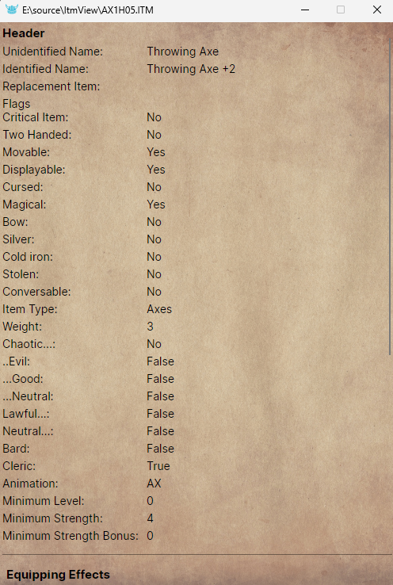

ItmView
=========

ItmView is a C# application for viewing ITM files from the Infinity Engine, using ii.InfinityEngine nuget package.

The application is a testbed for avalonia and the nuget package rather than a serious application, however it is functional.


## Usage

Run itmview and pass the full path to an itm file on the command-line, e.g.

`itmview C:\games\ie\bg\override\iisword.itm`

You can register itmview as the default application to handle itm files, allowing you to double-click the file in Windows Explorer to open the file, by running itmview with the register command-line with administrator privileges e.g.

`itmview register`

itmview supports pressing ESC to quit the application, in addition to the standard processes (x button, Alt+F4 etc.)





Note: If you place an Avalonia axaml file named override.axaml in the same directory as itmview.exe then that UI will be used in preference to the default UI. The datacontext of the view is automatically set to an ITMFile (file) and a collection of extended headers (ext). This allows you to customize the UI to display particular properties you find interesting/useful rather than the default set.

## Download

Compiled downloads are not available.

## Compiling

To clone and run this application, you'll need [Git](https://git-scm.com) and [.NET](https://dotnet.microsoft.com/) installed on your computer. From your command line:

```
# Clone this repository
$ git clone https://github.com/btigi/ItmView

# Go into the repository
$ cd src

# Build  the app
$ dotnet build
```

## Licencing

ItmView is licenced under the MIT License. Full licence details are available in licence.md

## Credits

The icon is modified from an icon provided by [icons8.com](https://icons8.com/).